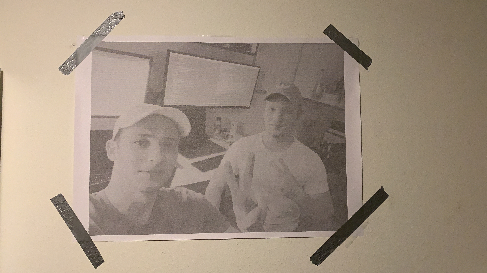

# Code used for ditherMe

Filter a long text and make a printable image out of it where you can read it up close and see the image from far away.
Printing on at least A0 sized paper is recommended.

